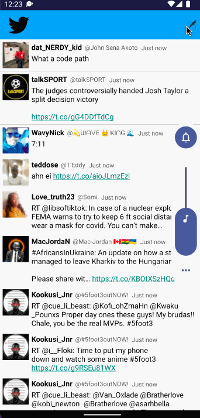

# Project 3 Unit 1 - *Simple Twitter*

**Simple Twitter** is an android clone of the widely known Twitter app.
Submitted by: **John Sena Akoto**

Time spent: **7** hours spent in total

## User Stories

The following **required** functionality is completed:

* [x] App can **sign in to Twitter using OAuth login**
* [x] User can **view the tweets from their home timeline**
* [x] User can **view relative timestamp**
* [x] User can **refresh tweets timeline by pulling down to refresh**

The following **optional** features are implemented:
* [x] User can **view more tweets as they scroll with infinite pagination**
* [x] User can **click tweets to launch web browser**
* [x] App has been **twitter branded**

The following **additional** features are implemented:

* [x] Nice UI additions

## Video Walkthrough

Here's a walkthrough of implemented user stories:

GIF created with [LiceCap](http://www.cockos.com/licecap/).

## Notes

Describe any challenges encountered while building the app.
The time in the android emulator is wrong, which causes relative timestamp to be wrong

## License

    Copyright [yyyy] [name of copyright owner]

    Licensed under the Apache License, Version 2.0 (the "License");
    you may not use this file except in compliance with the License.
    You may obtain a copy of the License at

        http://www.apache.org/licenses/LICENSE-2.0

    Unless required by applicable law or agreed to in writing, software
    distributed under the License is distributed on an "AS IS" BASIS,
    WITHOUT WARRANTIES OR CONDITIONS OF ANY KIND, either express or implied.
    See the License for the specific language governing permissions and
    limitations under the License.
